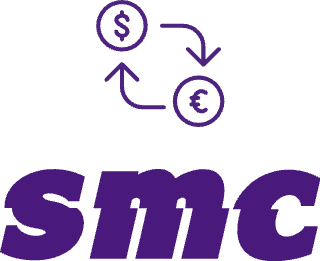

 English | <a href="./README_zh.md">简体中文</a>

The plug-in for symbol mapping conversion can customize the configuration conversion and the corresponding symbol mapping, configure the effective file type, and can have a bottom bar status switch and shortcut key to control whether the plug-in is enabled.

## Power

- You can control whether to start the plug-in through the switch in the bottom bar.

- You can control the switch by selecting the Switch the symbol-mapping-conversion bottom status bar command by `cmd + shift + p`

- You can configure `extLanguage` to exclude unwanted processing in these types of files, such as ['vue'], etc.

- Custom configuration `symbol-mapping-conversion.mappings`, you can add some rules in `settings`, for example, you encounter `¥` and want to map to `💰`

## :coffee:

[buy me a cup of coffee](https://github.com/Simon-He95/sponsor)

## License

[MIT](./license)

## Sponsors

  

