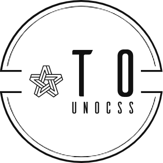

 <a href="./README.md">English</a> | 简体中文

>WIP: 符号映射转换的插件，可以自定义配置转换和对应的符号映射，可以配置生效的文件类型，和可以有一个底部栏状态切换开关和快捷键控制是否启用插件。

## :coffee:

[请我喝一杯咖啡](https://github.com/Simon-He95/sponsor)

## License

[MIT](./license)

## Sponsors

  

